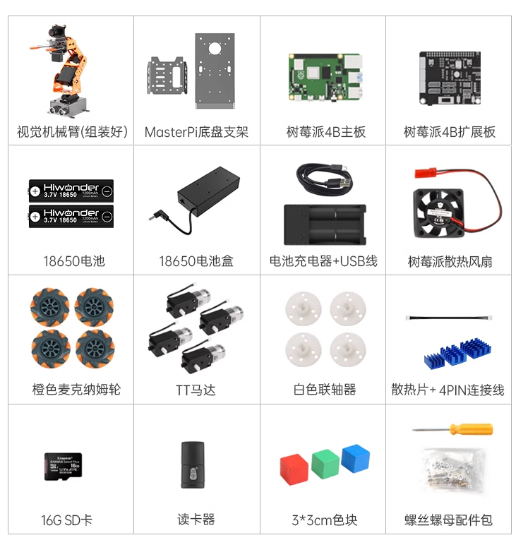

# 入门课程
##  1. 认识MasterPi智能视觉机器人

### 1.产品简介

MasterPi是一款基于树莓派开发的智能视觉机器人，它采用麦克纳姆轮底盘，并搭载5DOF机械臂和高清摄像头，配合OpenCV能实现色块分拣、目标追踪、视觉巡线、智能搬运等功能。

MasterPi搭载RGB发光超声波传感器，可以控制灯光变化，并能实现自主避障。此外，它还支持拓展多种传感器，实现更多感知的融合。

### 2.硬件介绍

**2.1硬件连接系统框图**

**2.2 摄像头**

摄像头作为机器人结构中最重要的组件之一，类似于人类眼睛。本款产品用的是130度广角单目相机。

**2.3 树莓派主控**

本款产品采用的是树莓派4B+扩展板。树莓派4B主板是一种小型的单板计算机，具有基本的计算能力，通过各种接口（如HDMI、USB、GPIO）支持多种外围设备的连接，使其成为学习编程、玩转各种创意项目的理想选择。

树莓派扩展板提供4路直流电机接口，同时板载按键、有源蜂鸣器、RGB灯、PWM/总线舵机接口等，搭配树莓派主控下能更好的进行二次开发与拓展。

**2.4 发光超声波**

芯片内部集成超声波发射电路、超声波接收电路、数字处理电路等。模块采用 IIC 通信接口，能通过 IIC通信进行读取超声波传感器测量的距离。

- **引脚说明**

| 引脚  | 引脚说明 |
| --- | --- |
| 5V  | 电源输入 |
| GND | 电源地 |
| SDA | SDA 数据线 |
| SCL | SCL时钟线 |

**2.5 机械臂舵机**

云台部分采用的是LFD-01M舵机，这款舵机具有控制精度高、线性度好、响应速度快和扭力大等特点，常用于各种仿生机器人的角度关节设计。

- **引脚说明**

| **引脚** | **引脚说明** |
| --- | --- |
| 黄色接线 | 信号线 |
| 红色接线 | 电源正极 |
| 棕色接线 | 地线  |

**2.6 直流电机**

电机为机器人的动力模块，本款产品使用的是减速比1:120的直流减速电机，其电压范围为DC3V-6V，输出功率0.6W，关于更多参数可前往“4 硬件资料”进行查看。

**2.7 锂电池**

本款产品采用的是两节3.7V的18650锂电池，电池容量为1800mAh，关于其充电方法可前往“第1章 学前先看/第3课 设备充电、开机及自检”查看。

###  3.产品清单 ###

